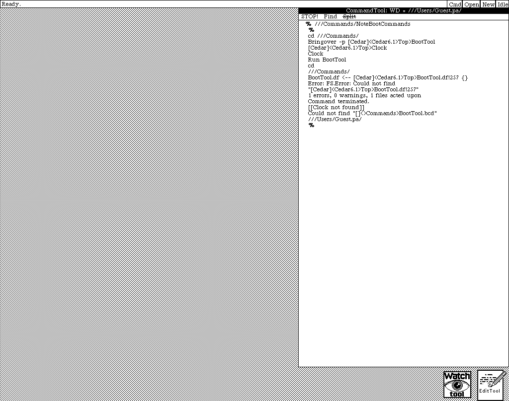

# Xerox Dorado Emulator

An emulator for the **Xerox Dorado** — the high-performance microcoded
research workstation built at Xerox PARC (Computer Science Lab) in
1978–1985. The Dorado was the follow-on to the [Alto][alto] and the
research-line predecessor of the productized [Star/8010][star]. It
hosted the Mesa, Cedar, Interlisp-D, and Smalltalk-80 environments by
loading different microcode emulators into its 4 K-word
microinstruction store.

To our knowledge no public Dorado emulator existed before this project.

The plan is two-phase:

1. **Phase 1 — C emulator.** Correct, observable, single-binary
   interpreter of Dorado 34-bit microinstructions, running real PARC
   microcode (Mesa, Cedar, AEmu, Smalltalk, Bootstrap, Initial). In
   progress.
2. **Phase 2 — Verilog.** A synthesizable RTL implementation that
   matches the C emulator's cycle-accurate behavior. Target: FPGA.

[alto]: https://en.wikipedia.org/wiki/Xerox_Alto
[star]: https://en.wikipedia.org/wiki/Xerox_Star

## Status

The microengine is real and runs original PARC microcode. Working
subsystems (all test-covered): the 34-bit microinstruction decoder, the
ALU/ALUFM datapath, full JCN branching, the shifter, 16-way hardware
tasking, the IFU, the memory subsystem (cache + Map + Pipe + BR), slow-
and fast-I/O routing, and a real BaseBoard (6502 + RIOTs) that cold-boots
the machine. Display, disk, and Ethernet have working device models.

**Boot progress.** The full BaseBoard → Bootstrap → Initial chain runs.
**Stage 1, Ethernet microcode boot, works end to end:** Initial falls
through to `EtherMicrocodeBoot`, an in-process fake Pup boot server
delivers `AltoMesaDorado.eb` (Pup types `264B`/`265B`), Initial verifies
the EB checksum, calls `LoadRam`, and the loaded Alto/Mesa emulator
microcode world starts (~61 M cycles in; run with a 140 M-cycle budget).

**Stage 2 — Ethernet software boot — the BCPL Net Executive runs, with a
working Pup network stack.** The loaded Alto/Mesa microcode boots NetExec
over Alto-style Ethernet (Mayday Pup `244B` + EFTP `30B`/`31B`), which
starts, installs its display list, and renders its banner — and you can
**type at its command line** in the windowed frontend. NetExec's full Pup
stack now functions against the in-process fake server: it **learns its
network number** (gateway-info `200B`/`201B`), **sets its clock** to the
host's real wall-clock time (Alto time `206B`/`207B`), and **discovers the
boot-file directory** (`257B`/`260B`). All replies are spec-correct
(verified against the Alto Pup driver source and the Living Computer
Museum IFS server), including the Pup checksum and the hardware-CRC framing
the AEmu receive microcode requires.

**Cedar 6.1 boots all the way to its Viewers desktop (2026-07-15).** The
second path loads the Cedar/Mesa microcode (`CedarDorado.eb!6`), plants the
matched Pilot **germ** (`--germ Dorado.germ-6.1.6`) into VM, and boots the
Pilot/Cedar physical volume from a PDI disk image (`--pilot-disk`). The full
chain — BaseBoard → Bootstrap → Initial → Cedar microcode → germ → Pilot →
Cedar → SimpleTerminal login (log in as `Guest`) → LoaderDriver remote
install over the in-process STP file server → demand-fetched Tioga fonts —
ends at the **live Cedar 6.1.0 Viewers desktop**: black herald bar, icon row,
a running Clock, and a CommandTool you can type at. This is, to our
knowledge, the first time a Dorado Cedar desktop has come up since the PARC
hardware was retired.



Run it instantly from the saved checkpoint with `make run-cedar-desktop-sdl`,
or watch the whole cold boot + install with `make run-cedar-work` (log in as
`Guest` at the `Name:` prompt). (Germ and microcode versions must match:
`CedarDorado.eb!6` is the 1984 build shipped with Cedar 5.3/6.0/6.1, so the
germ is `Dorado.germ-6.1.6`, not the older `Dorado.germ!4`.) Live state is in
`docs/CONTINUE-HERE.md`.

The keyboard for the native Cedar world is delivered to its KeyBits at
absolute `LONG[177033B]` with a display vertical-field naked-notify driving
`SimpleTerminalImpl`'s keyboard watcher — grounded in `TerminalDefs.mesa`
(`KeyName`), `TerminalHeadDorado.mesa`, and HM Table 24 (the 7-wire
back channel). The Cedar full-page "lf" monitor is **1024×808**; the
framebuffer presents each world at its native raster (Alto 808×606, Cedar
1024×808).

**It runs in your browser.** A WebAssembly build (`make web`, deployed to
GitHub Pages by `.github/workflows/deploy-pages.yml`) boots every world from
a dropdown: the Alto games and NetExec menu, the Alto Executive from disk,
the Mesa Network Executive, **Cedar 6.1** (a saved Viewers-desktop
checkpoint and a saved login-prompt checkpoint), and **Interlisp-D Lyric**
(a saved Exec/XCL desktop). The emulator runs ~24 M microinstructions/s
(≈1.4× the real 16.67 MIPS Dorado) after a hot-path `getenv()` caching fix
(~2.7× speedup).

Along the way the bring-up fixed **six real microengine bugs** — the Mesa
`WF`/`RF` field opcodes, `TisId`/`RisId` + `IFetch` operand handling, the
`Q←B` Pipe-source side-effect, the `Overflow` branch condition, shifter
Pd-mux masking, and `Return` clobbering a same-instruction explicit
`Link←` load (the bug that kept Cedar's desktop from coming up — an
explicit `Link←` overrides Return's normal `Link←CIA+1` reload, per the
PARC microcode's own comments in `DMesaFloat.mc`) — and
the microengine was cross-checked against the board schematics
(`docs/schematic-audit.md`).

**Boot media.** The Alto worlds boot over the in-process fake Ethernet/EFTP
server (no preserved Alto Dorado pack exists — the CHM PARC archive is an IFS
file-server dump, not bootable packs). Cedar boots from a Pilot/Cedar **PDI**
disk image served through a PDI-backed SA4000 bridge (the boot volume
`CedarDisk/CedarDorado-boot.pdi`, and the larger `CedarDorado-work.pdi`
working volume the desktop install runs on); the compressed images are
tracked in-repo and decompressed on demand by make. The desktop checkpoint
(snapshot + matching PDI, since the install mutates the disk) lives gzipped
in `dorado/snapshot-assets/` and is rehydrated automatically.

**`docs/running-the-emulator.md` is the runbook** — every software
combination (microcode worlds, germs, OS/app boot files) and the exact
command to load each. See also `docs/ethernet-architecture.md` and
`docs/ethernet-local-boot-plan.md` for the protocol and the phased plan,
`docs/CONTINUE-HERE.md` for the live bring-up state, `docs/handoff.md` and
`dorado/CLAUDE.md` for the code-side guide and the punch list of remaining
emulation gaps, and `docs/schematic-audit.md` / `docs/hardware-specs.md`
for the schematic audit and specs for unbuilt hardware.


## Build & run

```sh
cd dorado
make            # builds the headless emulator + tools + test binaries
make test       # runs all test suites
```

The core emulator is C99 with no external dependencies. Tested on macOS
(Apple clang) and Linux.

### In the browser (WebAssembly)

`make web` (needs the Emscripten SDK on `PATH`) builds a WebAssembly build
that runs entirely in the browser; the live build is published to GitHub
Pages by `.github/workflows/deploy-pages.yml` on every push to `main`. A
dropdown picks the world: the **NetExec** menu and Alto games, the **Alto
Executive** (disk boot), the **Mesa Network Executive**, **Cedar 6.1** —
a saved **Viewers desktop** checkpoint (instant) or a saved login-prompt
checkpoint — and **Interlisp-D Lyric** (saved Exec/XCL desktop). Serve
`dorado/web/` over http (a `file://` URL won't load the `.wasm`). Mouse
buttons work as described under "Controls" below — including the
Option/Alt- and Cmd/Ctrl-click modifiers on laptops (the page suppresses
the browser context menu over the display).

### Windowed frontend (SDL) — boot a world and type at it

The `dorado-sdl` frontend opens a window, rasterizes the display list each
frame, and feeds your keyboard and mouse to the running world. It presents at
each world's native raster — 808×606 for the Alto worlds, 1024×808 for the
Cedar "lf" monitor — and resizes when you switch. Once a prompt appears (the
Net Executive `>`, or Cedar's `Name:`) you can type, just as on the real
machine.

It needs **SDL2** (the core emulator does not):

```sh
# macOS:   brew install sdl2
# Debian/Ubuntu:  sudo apt install libsdl2-dev
```

Build the frontend and the bootable microcode worlds (all from the
`dorado/` directory). The worlds live in the tree — nothing in `/tmp`:

```sh
cd dorado
make sdl          # -> build/dorado-sdl
make worlds       # -> worlds/aemu.eb (the Alto-emulator world, from AEmu.mb)
```

The Cedar/Mesa worlds need no generation — they are ready `.eb` files
already checked into `../chm`.

#### Controls (keyboard + three-button mouse)

The keyboard maps through to the running world once its prompt is up.
**Cmd/Ctrl+V** pastes the host clipboard into the guest as paced
keystrokes (handy for Cedar's long `Eval` lines); **F1** pauses/resumes
the emulation; **Cmd/Ctrl+Q** quits.

The Dorado's mouse has **three buttons**, and Cedar uses all of them
(Xerox names in parentheses): **left = Red** — point/select, **middle =
Yellow** — pop up menus, **right = Blue** — extend/adjust. Both frontends
(SDL and the browser build) wire them the same way:

| You do | Dorado button |
|---|---|
| Left click | **Red** (point/select) |
| Middle click | **Yellow** (menus) |
| Right click | **Blue** (extend) |
| **Option/Alt + left click** | **Yellow** (menus) |
| **Cmd or Ctrl + left click** | **Blue** (extend) |

A real three-button mouse just works. On a laptop trackpad, hold the
modifier *before* pressing: the button is decided at press time and held
until release, so a modifier chord behaves like holding the real middle or
right button (drag included). In the browser, right-click is delivered to
the emulator and the page's context menu is suppressed over the display.

#### Boot recipes by environment

A run has two payloads: the **emulator microcode** (`--eb`, the world our
substituted Initial delivers over the Dorado microcode boot) and the
**Stage-2 software** (`--eftp`, fetched over EFTP by that world). The real
Dorado picks its world by which microcode is installed on disk (booting
memo §1.5: `InitialEtherAltoMesaDorado.eb` for Alto/Mesa,
`InitialEtherSmalltalkDorado.eb` for Smalltalk, `CedarDorado.eb` for Cedar,
etc.); here you choose it directly with `--eb`. Every recipe runs windowed
(`build/dorado-sdl …`) or headless (`build/dorado … --cycles N --out
screen.pgm`).

**A boot file's format dictates which microcode (`--eb`) it needs.** Check
the first word of any boot file with `od -An -to2 -N2 FILE` (`od` prints the
two bytes byte-swapped): `0o002401` is an **Alto B-format** file (word0 =
`0o405`) and runs on the Alto emulator world `worlds/aemu.eb`; `0o162400`
is a **Mesa/Pilot outload** (word0 = `0o345`) and needs the Cedar/Mesa
emulator world `../chm/dorado/CedarDorado.eb!6`. A Mesa-format file cannot
run on AEmu — the Alto interpreter just mis-runs its Mesa bytecodes (the IFU
instruction set stays `insset=0`), so nothing paints and nothing executes.

##### Group A — Alto emulator (`worlds/aemu.eb`) — WORKING

The Alto-emulator world runs the BCPL Net Executive and any Alto B-format
(`0o002401`) boot file. These come up and are interactive today. Each has a
`make run-…` shortcut (run from `dorado/`).

```sh
# Net Executive — interactive: learns its net + the real time, lists the
# boot directory under `?`, accepts typed commands at the `>` prompt
./build/dorado-sdl --eb worlds/aemu.eb --eftp '../chm/bootfiles/NETEXEC.BOOT!8'     # make run-netexec

# CRTTEST — CRT alignment/test patterns; press keys to cycle the patterns
./build/dorado-sdl --eb worlds/aemu.eb --eftp '../chm/bootfiles/CRTTEST.BOOT!1'     # make run-crttest

# DMT — the diagnostic/idle program a diskless Alto boots
./build/dorado-sdl --eb worlds/aemu.eb --eftp '../chm/bootfiles/DMT.BOOT!22'        # make run-dmt
```

**NetExec game menu (`--boot-dir-all`, on by default).** Booting `NETEXEC.BOOT` with
`--boot-dir-all` (the default when no explicit `--boot-dir` is given) makes the Net
Executive advertise every Alto B-format boot file in `chm/bootfiles/` as a boot
directory over the `257B`/`260B` boot-directory protocol. At the `>` prompt, type `?`
to list the directory, then a game name (e.g. `Galaxian`) to boot it — NetExec sends a
Mayday for that file, the in-process EFTP server streams it, and it boots over the
emulated wire. Every asset is read-only (microcode + `.boot` files), so this "type a
game name" experience is the natural shape for a future in-browser (Emscripten) demo.
(The headless `--type` keystroke path can pre-fetch the directory; the full typed boot
is driven via the SDL frontend.)

```sh
# Game menu: boot the Net Executive with the full boot directory, then at the `>`
# prompt type `?` to list the games and a name (e.g. Galaxian) to boot one.
./build/dorado-sdl --eb worlds/aemu.eb --eftp '../chm/bootfiles/NETEXEC.BOOT!8' --boot-dir-all
# equivalently: make run-netexec   (the directory is advertised by default)
```

Games and utilities downloaded from `https://xeroxalto.computerhistory.org/Io/Murray/`
and verified Alto B-format (`0o002401`). Tested headless at 100 M cycles; pixel counts
are snapshot display-list pixels from `dorado-screen.pgm`. All load at ~32 M cycles.

| Program | What it is | make target | Pixels at 100 M cyc |
|---|---|---|---|
| Galaxian.boot!1 | Space Invaders-style arcade (CHM Murray) | `run-galaxian` | 124,239 — paints |
| MissileCommand.boot!1 | Missile Command arcade (CHM Murray) | `run-missilecommand` | 368,448 — paints |
| PinBall.boot!1 | Pinball arcade (CHM Murray) | `run-pinball` | 85,117 — paints |
| AstroRoids.boot!1 | Asteroids-style game (CHM Murray) | `run-astroids` | 163 — minimal (needs input/more cycles) |
| Invaders.boot!1 | Space Invaders (CHM Murray) | `run-invaders` | 163 — minimal (needs input/more cycles) |
| Reversi.boot!1 | Reversi board game (CHM Murray) | `run-reversi` | 831 — boots, minimal display |
| Pool.boot!1 | Pool/billiards game (CHM Murray) | `run-pool` | 0 — boots, no display at 100 M cyc |
| StarWars.boot!1 | Star Wars game (CHM Murray) | `run-starwars` | 0 — boots, no display at 100 M cyc |
| Trek.boot!1 | Star Trek game (CHM Murray) | `run-trek` | 0 — boots, no display at 100 M cyc |
| Boggs.boot!1 | Alto program (CHM Murray) | `run-boggs` | 0 — boots, no display at 100 M cyc |
| EtherLoad.boot!1 | Ethernet boot loader utility (CHM Murray) | `run-etherload` | 365,073 — paints |
| EDP.boot!1 | Ethernet diagnostic program (CHM Murray) | `run-edp` | 37,985 — paints |
| KeyTest.boot!1 | Keyboard test utility (CHM Murray) | `run-keytest` | 25,424 — paints |
| Calculator.boot!1 | On-screen calculator (CHM Murray) | `run-calculator` | 12,431 — paints |
| MadTest.boot!1 | Memory/ALU diagnostic (CHM Murray) | `run-madtest` | 7,316 — paints |
| PupTest.boot!1 | Pup network test (CHM Murray) | `run-puptest` | 6,814 — paints |
| BFSTest.boot!1 | BFS filesystem test (CHM Murray) | `run-bfstest` | 6,802 — paints |
| Scavenger.boot!1 | Disk scavenger/repair (CHM Murray) | `run-scavenger` | 4,032 — paints text UI |
| DiEx.boot!1 | Disk exerciser (CHM Murray) | `run-diex` | 1,969 — minimal |
| EtherWatch.boot!1 | Ethernet packet monitor (CHM Murray) | `run-etherwatch` | 965 — minimal text |
| Messenger.boot!1 | Alto messaging client (CHM Murray) | `run-messenger` | 383 — minimal |
| FTP.boot!1 | File Transfer Protocol client (CHM Murray) | `run-ftp` | 0 — boots, no display |
| CopyDisk.boot!1 | Disk copy utility (CHM Murray) | `run-copydisk` | 0 — boots, no display |
| GateControl.boot!1 | Gateway control utility (CHM Murray) | `run-gatecontrol` | 0 — boots, no display |
| Clock.boot!1 | Alto clock display (CHM Murray) | `run-clock` | 0 — boots, no display |
| ShowAIS.boot!1 | Show AIS data utility (CHM Murray) | `run-showais` | 0 — boots, no display |
| Neptune.boot!1 | Alto disk/file tool (CHM Murray) | — | 14,158 — paints init screen |
| What.boot!1 | Alto info utility (CHM Murray) | — | 301 — minimal |
| Johnsson.boot!1 | Alto program (CHM Murray) | — | 0 — boots, no display |
| Kal.boot!1 | Alto calendar (CHM Murray) | — | 0 — boots, no display |

```sh
# headline games — all paint without any keyboard input
./build/dorado-sdl --eb worlds/aemu.eb --eftp '../chm/bootfiles/Galaxian.boot!1'          # make run-galaxian
./build/dorado-sdl --eb worlds/aemu.eb --eftp '../chm/bootfiles/MissileCommand.boot!1'    # make run-missilecommand
./build/dorado-sdl --eb worlds/aemu.eb --eftp '../chm/bootfiles/PinBall.boot!1'           # make run-pinball

# other games (load and start; may need keyboard/more cycles to show game screen)
./build/dorado-sdl --eb worlds/aemu.eb --eftp '../chm/bootfiles/AstroRoids.boot!1'        # make run-astroids
./build/dorado-sdl --eb worlds/aemu.eb --eftp '../chm/bootfiles/Invaders.boot!1'          # make run-invaders
./build/dorado-sdl --eb worlds/aemu.eb --eftp '../chm/bootfiles/Reversi.boot!1'           # make run-reversi
./build/dorado-sdl --eb worlds/aemu.eb --eftp '../chm/bootfiles/Pool.boot!1'              # make run-pool
./build/dorado-sdl --eb worlds/aemu.eb --eftp '../chm/bootfiles/StarWars.boot!1'          # make run-starwars
./build/dorado-sdl --eb worlds/aemu.eb --eftp '../chm/bootfiles/Trek.boot!1'              # make run-trek

# utilities and diagnostics that paint (no network/disk needed for initial display)
./build/dorado-sdl --eb worlds/aemu.eb --eftp '../chm/bootfiles/EtherLoad.boot!1'         # make run-etherload
./build/dorado-sdl --eb worlds/aemu.eb --eftp '../chm/bootfiles/EDP.boot!1'               # make run-edp
./build/dorado-sdl --eb worlds/aemu.eb --eftp '../chm/bootfiles/KeyTest.boot!1'           # make run-keytest
./build/dorado-sdl --eb worlds/aemu.eb --eftp '../chm/bootfiles/Calculator.boot!1'        # make run-calculator
./build/dorado-sdl --eb worlds/aemu.eb --eftp '../chm/bootfiles/MadTest.boot!1'           # make run-madtest
./build/dorado-sdl --eb worlds/aemu.eb --eftp '../chm/bootfiles/Scavenger.boot!1'         # make run-scavenger
./build/dorado-sdl --eb worlds/aemu.eb --eftp '../chm/bootfiles/EtherWatch.boot!1'        # make run-etherwatch
./build/dorado-sdl --eb worlds/aemu.eb --eftp '../chm/bootfiles/FTP.boot!1'               # make run-ftp
```

##### Group B — Cedar 6.1 / Pilot — boots to the Viewers desktop

Cedar boots from a Pilot/Cedar physical volume, not over Ethernet (Dorado
Booting memo §1.3). The emulator loads the Cedar microcode, plants the
matched Pilot germ, and boots a PDI disk image. Three ways in, fastest
first:

```sh
# 1. THE DESKTOP, INSTANTLY — restore the saved Viewers-desktop checkpoint
#    (snapshot + its matching post-install disk, rehydrated from
#    snapshot-assets/). Live Clock, CommandTool, menus — use the mouse
#    (see Controls above). It comes up with a printed welcome menu, and
#    one-word commands ready to type at the CommandTool's % prompt:
#      Schematic.cm  the Dorado draws its OWN processor board
#      Moon.cm       a 1978 moon photograph, halftoned
#      Memo.cm       Ed Taft's 1980 Dorado Booting memo, in Tioga
#      Chess.cm      installs and runs ChessHack over the emulated net
#      Welcome.cm    prints the full list again
#    The same actions are buttons in the CommandTool's menu line.
make run-cedar-desktop-sdl

# 2. The full cold boot + install, end to end (~21 G cycles): boots the
#    work volume, log in as "Guest" (+ Return twice) at the Name: prompt;
#    LoaderDriver then installs Basic.Loadees/BootEssentials/fonts over the
#    in-process STP server and the desktop comes up.
make run-cedar-work

# 3. Just the boot volume to the SimpleTerminal login prompt (the login
#    prompt appears around 640 M cycles; no install set on this volume):
make run-cedar

# by hand, recipe 3 is:
./build/dorado-sdl --boot-reason disk --no-alto-boot \
    --eb '../chm/dorado/CedarDorado.eb!6' \
    --germ '../chm/cedar/germ-alt/Dorado.germ-6.1.6' \
    --pilot-disk '../CedarDisk/CedarDorado-boot.pdi'

# headless self-test: echoes "abc" at the Name: prompt into /tmp/cedar.pgm
make run-cedar-screenshot
```

`--germ` plants the Pilot germ into VM and `--pilot-disk` mounts the PDI as
drive 0; `--boot-reason disk` selects the disk boot (no boot-key chord);
`--ftp-root` points the in-process STP file server at the install tree
(`chm/cedar/stp-root/`). Germ and microcode versions must match
(`CedarDorado.eb!6` ↔ `Dorado.germ-6.1.6`).

To regenerate the desktop checkpoint after changing the emulator or the
install tree, run `make cedar-desktop-snapshot` (headless, hours — it
replays the whole cold boot + install and saves the snapshot together with
the mutated PDI; the two are a matched pair) and
`make cedar-desktop-web-snapshot` for the browser build (wasm snapshots are
ABI-separate from native ones).

The Mesa/Pilot outload boot files (`CedarNetExec.boot`, `MesaNetExec.boot`,
`NEWOS.BOOT`, …) are the *next* stage the germ would request once it reaches
`DoInLoad` over the net; the EFTP/Mayday server already serves them
byte-exact, but Cedar boots from the disk image.

##### Group C — Mesa Network Executive — boots and paints its herald

The **Alto/Mesa** world (`AltoMesaDorado.eb!2`, the full Mesa VM, not the
Alto/Nova-only `aemu.eb`) boots the **Mesa Network Executive** over EFTP — a
Mesa/Pilot environment, Cedar's sibling. It loads the whole outload, installs
an Alto-style display list, and renders its herald + cursor:

```sh
./build/dorado-sdl --eb '../chm/dorado/AltoMesaDorado.eb!2' \
    --eftp '../chm/bootfiles/MesaNetExec.boot!1'
```

In the WebAssembly build this is the "Mesa Network Executive" dropdown entry.
The Mesa-format games/utilities in `chm/bootfiles/` (`Chat`, `Fly`, `PPong`,
`Pupwatch`, `TriEx`, `Murray` — first word `0o345`) need this Mesa world too,
but currently load without painting (likely need input or to be launched from
the Mesa NetExec). Pilot OS outloads (`NEWOS.BOOT`) want the germ/disk path
like Cedar, not EFTP.

##### Other worlds

**Smalltalk — experimental.** The Smalltalk emulator microcode loads
through the boot chain, but Smalltalk needs its own loaded image to come up
(none is wired yet):

```sh
./build/dorado-sdl --eb '../chm/microcode/SmalltalkDorado.eb!1' \
                   --eftp '../chm/bootfiles/NETEXEC.BOOT!8'
```

**Interlisp-D — boots to the Lyric desktop.** The Lisp path boots
`lisp.run` from a Trident pack and loads a Lyric (1987) sysout, coming up
in the Interlisp-D Exec (XCL) desktop with its Prompt Window:

```sh
make run-lisp-snapshot-sdl   # resume the saved XCL-desktop checkpoint
make run-lisp-good-sdl       # the full boot + sysout load, end to end
```

(`make lisp-lyric-desktop-snapshot` regenerates the checkpoint. In the
browser build this is the "Lyric — saved Exec (XCL) desktop" entry.)

#### Booting a second-stage file *through* NetExec (`--boot-dir`)

The real NetExec is a network command processor: at its `>` prompt you
type the *name* of another boot file and it loads that next. NetExec
discovers which files exist by broadcasting a **boot-directory probe** (Pup
`257B`); boot servers answer (`260B`) with `{boot file number, date, name}`
tuples. Register the files our fake server should advertise with
`--boot-dir NAME=BFN=PATH` (repeatable; `BFN` octal, `NAME` must end in
`.boot`):

```sh
./build/dorado-sdl --eb worlds/aemu.eb \
    --eftp '../chm/bootfiles/NETEXEC.BOOT!8' \
    --boot-dir 'CRTTEST.boot=111=../chm/bootfiles/CRTTEST.BOOT!1'
```

NetExec then lists the registered name under `?`; typing it sends a Mayday
for that boot file number, which the server serves from the registered path.
(The breath-of-life that loads NetExec itself uses boot file 0 and the plain
`--eftp` file.) Note the file you chain to must be an Alto B-format file to run on
`worlds/aemu.eb`. A Mesa-format file (e.g. `CedarNetExec`) downloads but
will not execute there — Mesa bytecodes are decoded as Nova instructions
(`insset=0`). Cedar itself runs via the disk/germ path in Group B above, not
by chaining a Mesa outload through the Alto NetExec.

Booting takes a little while (the real BaseBoard → Bootstrap → Initial →
Ethernet-microcode chain, then the EFTP transfer of the boot file); the
Alto/Mesa banner and `>` prompt appear once it is up, after which typing
works. A second-stage file you select (e.g. `CedarNetExec`) is itself a
large transfer — give it a moment after the screen clears.

Flags: `--eb PATH` (emulator-microcode world), `--eftp PATH` (Stage-2 boot
file), `--germ PATH` + `--pilot-disk PATH` + `--boot-reason disk` (the
Cedar/Pilot disk boot), `--ftp-root DIR` (in-process STP file server),
`--snapshot-in/--snapshot-out PATH` (machine checkpoints),
`--boot-file-number OCTAL` (boot file number, default `110`),
`--boot-dir NAME=BFN=PATH` (advertise a boot file to NetExec; repeatable),
`--scale N` (window scale), `--speed CYCLES` (cycles/frame), `--quote`,
`--no-alto-boot`, `--screenshot F1,F2,...`. Keyboard and three-button-mouse
bindings are under "Controls" above.

`--boot-file-number` sets the Mesa/Dorado **boot file number** — the value
a real machine derives from the boot button and keyboard and hands to the
booting microcode. It is the first word of the three-word boot-parameter
block (`STK[1..3]`: boot file number, `BootParameterSeal`, and a checksum
word that makes the three sum to 0 mod 2^16); the emulator plants the
block directly because the 7-wire terminal back-channel that would carry
it is not modeled. The same number selects the netboot file Initial
requests. The default `110` (octal) is the normal Mesa/Alto net boot and
is what every path above uses — you only need this flag to experiment with
a different boot file number.

A headless build (`build/dorado`, same flags plus `--cycles N`,
`--type STRING`, `--out screen.pgm`) renders to a PGM snapshot for
scripted/CI use.

## Repository layout

```
.
├── README.md                          this file
├── CLAUDE.md                          project mission, working norms
├── docs/                              architecture references
│   ├── INDEX.md                       map of every artifact
│   ├── architecture.md                distilled architecture (HM §1–4)
│   ├── memory-architecture.md         memory subsystem reference
│   ├── jcn-encoding.md                JCN field encoding (HM Figure 6)
│   ├── chm-archive.md                 CHM mirror inventory
│   ├── chm-urls.md                    URL convention + curl recipes
│   ├── altoinfo-survey.md             what's reusable from AltoInfo (gitignored)
│   └── glossary.md
├── dorado/                            ★ the C emulator
│   ├── CLAUDE.md                      in-directory guide
│   ├── Makefile, compile_commands.json
│   ├── include/{mb,disasm,microcode,cpu}.h
│   ├── src/{mb,disasm,microcode,cpu,mbdis}.c
│   └── tests/test_{mb,disasm,microcode,cpu}.c
├── chm/                               microcode pulled from CHM
│   ├── microcode/                     17 ready-to-load .eb/.pb worlds
│   ├── microd/                        full MicroD BCPL source
│   ├── microd-manual/                 MicroD user manual + Alto exec
│   ├── dorado/                        canonical _cd8_/dorado/ tree
│   │   ├── *.mb / *.midas             every Dorado emulator
│   │   └── expanded/                  unpacked .dm archives
│   ├── io-doradologic/                schematic-source archives (selected)
│   └── indigo-dorado/                 directory index for older versions
├── DoradoDocs/schematics/                 board PDFs + Hardware Manual + cross-ref index
├── DoradoDocs/                        full schematic revision history
└── firmware/              5 BaseBoard EPROM dumps + chip-label photo
```

## Documentation

The Hardware Manual (`DoradoDocs/manuals/Dorado_Hardware_Manual_Sep1981.pdf`)
is the canonical reference for everything. Read its TOC; bookmark
Tables 5–13 (microinstruction fields), §3 (processor), §4 (control),
§5 (memory), §6 (IFU), Figures 1, 6, and 8.

The April 1980 booting memo
(`DoradoDocs/manuals/Dorado_Booting_Operation_and_Mechanisms_Apr80.pdf`)
explains the Bootstrap → Initial → emulator microcode chain.

## Microcode and tools sourced from CHM

`chm/` was pulled from the **Xerox PARC Archive** at the Computer
History Museum:

- https://xeroxparcarchive.computerhistory.org/ — fuller PARC IFS dump,
  contains the canonical Dorado source tree at `_cd8_/dorado/`.
- https://xeroxalto.computerhistory.org/ — narrower Alto-era mirror,
  contains the `Io/Murray/` boot-file collection plus MicroD source.

URL convention and curl recipes for re-fetching are documented in
`docs/chm-urls.md`.

## License

The C emulator code in `dorado/` and the documentation in `docs/` and
this repo's root are © 2026 contributors and licensed under the MIT
License (see `LICENSE`).

The Xerox PARC documents in `DoradoDocs/schematics/`, `DoradoDocs/`,
`firmware/`, and `chm/` originated at Xerox Corporation
and are reproduced from the Computer History Museum's public archive
of PARC materials. They are included verbatim for reference and to
make this repository self-contained for testing; they are *not* part
of the original work and retain whatever rights Xerox/CHM holds.

## Acknowledgements

- E. R. Fiala for the 1981 Hardware Manual and decades of preservation
  effort.
- Ed Taft for the Booting memo and Pup/EtherBoot.
- Butler Lampson, Ken Pier, Chuck Thacker, and the rest of the PARC
  CSL Dorado team.
- Al Kossow, Bitsavers, and the Computer History Museum for hosting
  the IFS archives.
- Juergen Buchmueller (salto) and Josh Dersch / Living Computers Museum
  (ContrAlto) — their Alto-emulator source trees are invaluable
  cross-references; reusable findings are catalogued in
  `docs/altoinfo-survey.md`.
