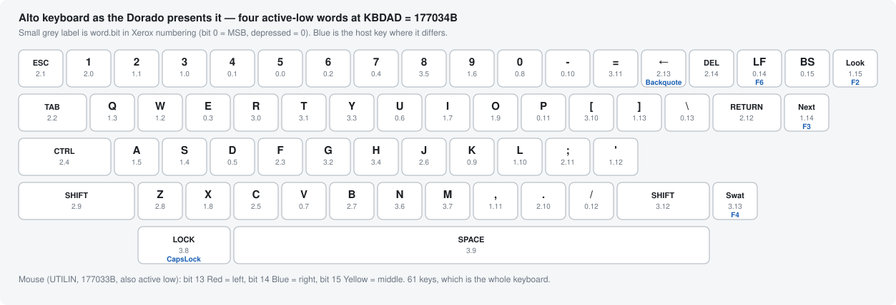

# Xerox Dorado emulator

A software emulator of the **Xerox Dorado** — the PARC research workstation
of 1978–1985, the machine the Alto's designers built next. It is a 16-bit
microprogrammed ECL machine with a 60 ns microinstruction cycle, and it has
no instruction set of its own: Mesa, Cedar, Interlisp-D, Smalltalk-76 and the
Alto are all *microprograms* loaded into its 4096 × 34-bit control store. So
this emulates the microengine, and the environments come up on top of it from
their original Xerox binaries.

Currently booting, from period artifacts: the **Alto OS** and its games,
**Cedar 6.1** to its Viewers desktop, **Interlisp-D Lyric** to its Exec, the
**Mesa** Network Executive, and **Smalltalk-76** to Top View. Native builds
run faster than the real hardware; there is also a WebAssembly build.

- `CLAUDE.md` — project mission, architecture, and current status
- `docs/running-the-emulator.md` — how to run every combination
- `docs/CONTINUE-HERE.md` — live bring-up state
- `docs/INDEX.md` — map of every document and artifact

```sh
cd dorado && make && make test      # build and run the test suite
make sdl && make run-galaxian       # a windowed Alto world
make run-cedar-work                 # Cedar 6.1 to its desktop
```

## Keyboard

The Dorado presents an Alto keyboard. The terminal's own microcomputer
serialises keyboard and mouse into one message stream (Dorado HW Manual
Table 24) and the microcode deposits it at the Alto's memory-mapped
locations: **four 16-bit words at `KBDAD` = `177034B`**, plus the mouse
buttons and keyset at `177033B`. Everything is **active low** — a depressed
key reads 0, an idle key reads 1 — which is worth remembering, because an
unseeded cell reads as *every key held down*.

Bit numbering below is Xerox convention, **bit 0 = MSB**.



*(Regenerate with `tools/make_keyboard_svg.py docs/images/alto-keyboard-map.svg`.
The word/bit labels are Alto Hardware Manual Figure 6, doc p.27; the physical
arrangement follows the placement notes in Cedar's `TerminalDefs.mesa` over
the standard QWERTY body, so it is a reconstruction rather than a traced
photograph.)*

### The four words, bit by bit

| bit | `KBDAD` (word 0) | `KBDAD+1` (word 1) | `KBDAD+2` (word 2) | `KBDAD+3` (word 3) |
|----:|---|---|---|---|
| 0 | 5 | 3 | 1 | R |
| 1 | 4 | 2 | ESC | T |
| 2 | 6 | W | TAB | G |
| 3 | E | Q | F | Y |
| 4 | 7 | S | CTRL | H |
| 5 | D | A | C | 8 |
| 6 | U | 9 | J | N |
| 7 | V | I | B | M |
| 8 | 0 | X | Z | LOCK |
| 9 | K | O | left SHIFT | SPACE |
| 10 | - | L | . | [ |
| 11 | P | , | ; | = |
| 12 | / | ' | RETURN | right SHIFT |
| 13 | \ | ] | ← | Swat |
| 14 | LF | Next | DEL | *(unused)* |
| 15 | BS | Look | *(unused)* | *(unused)* |

Alto I and Alto II differ only in the keytops printed on the last few keys —
the bits are the same, and both are what this table describes. **Look**,
**Next** and **Swat** are the Alto's three unmarked keys (Cedar's
`TerminalDefs.mesa` names them `Spare1`, `Spare2`, `Spare3`); Interlisp reads
all three as mouse-event modifier bits, so they are not decorative.

The mouse and the 5-key keyset share `177033B`, also active low: **bit 13
Red = left**, **bit 14 Blue = right**, **bit 15 Yellow = middle**.

### Host keys

Letters, digits, punctuation, Space, Return, Tab, Esc, Backspace, Delete,
Shift and Control are the obvious ones. The rest are stand-ins, chosen for
being free on a modern keyboard rather than for resembling the keytops:

| Alto key | host key | notes |
|---|---|---|
| `←` (left arrow) | **`** backquote | the Alto's `_`/`^` key; no modern keytop |
| LF | **F6** | |
| Look | **F2** | blank key right of BS |
| Next | **F3** | blank key right of RETURN |
| Swat | **F4** | blank key, lower right corner |
| LOCK | **Caps Lock** | mirrored as a *latch*, not as press/release |
| — | **F1** | pause/resume the emulator (not an Alto key) |

**Control goes to the guest**, including `Ctrl-W`, `Ctrl-E` and `Ctrl-L`,
which is how you drive an Interlisp Exec or a Cedar viewer. In the browser
the one exception is `Ctrl-V`, which stays with the browser so clipboard
paste keeps working; `Cmd` is left to the browser everywhere.

Mouse: left/middle/right map to Red/Yellow/Blue. In the browser, if you have
no middle button, **Option+click** is middle (Yellow) and **Cmd/Ctrl+click**
is right (Blue).

### Notes per world

- **Interlisp-D** puts its menus on the **right/blue** button. Press on the
  background for the system menu; move onto an item to select it, and *right*
  out of an item with a `>` to open its submenu.
- **Cedar** takes its keyboard from the same words, delivered to `KeyBits` at
  `177033B` — that block starts at the mouse word and runs forward over the
  four keyboard words.
- **Smalltalk-76** polls the keyset in `177033B` at startup and stops with
  "The keyset is stuck" if it reads as held, which is what an unseeded
  active-low cell looks like.

Full audit, including what was checked against which source and the bugs it
found: `docs/parc-feedback-todo.md`, section A.
